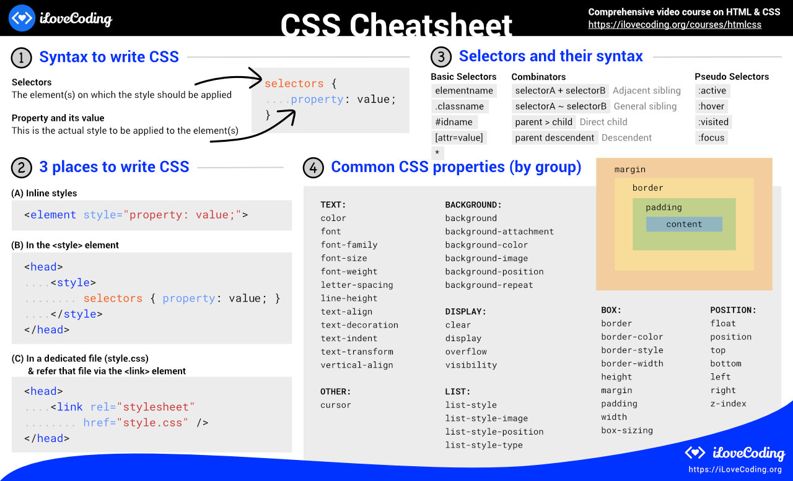

# 🔥 CSS Cheatsheet 🗺️️️️️🗺️️️
This is the cheatsheet on how to use CSS. In here you will find:

1. The basic syntax of CSS
1. The terminologies used
1. The 3 places to write CSS
1. Common selector types
1. And the common properties organized by group

Remember! The most authoritative documentation on web technology and CSS is the Mozilla Documentation. For a full [CSS Reference, click here](https://developer.mozilla.org/en-US/docs/Web/CSS/Reference)

Want to learn HTML & CSS? [here's an awesome video course](https://ilovecoding.org/courses/htmlcss2)

## I present to you - The CSS Cheatsheet 💪

Download [PDF](css-cheatsheet.pdf) or [Image](css-cheatsheet.gif)

## ️Want an HTML Cheatsheet as well?

Check out this [HTML Cheatsheet](https://github.com/iLoveCodingOrg/html-cheatsheet)
